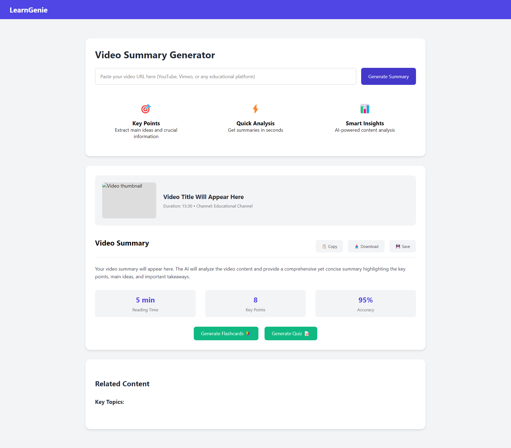

# LearnGenie 🎓

LearnGenie is an AI-powered educational platform that transforms video content into comprehensive learning materials. It helps students and educators maximize learning efficiency by automatically generating summaries, flashcards, and quizzes from educational videos.

## Features ✨

- **Video Summaries**: Extract key points and main ideas from any educational video
- **Smart Flashcards**: Automatically generate study cards from video content
- **Custom Quizzes**: Create intelligent assessments based on video material
- **AI Analysis**: Advanced content processing for accurate information extraction
- **Responsive Design**: Fully responsive interface that works on all devices
- **User Authentication**: Secure login and registration system
- **Interactive Learning**: Engaging study tools with immediate feedback


## Screenshots

### Home Page

SSS
### Summary page


## Tech Stack 🛠️

- **Frontend**: 
  - HTML5/CSS3
  - Vanilla JavaScript
  - EJS (Embedded JavaScript templates)
  - Responsive design with CSS Grid and Flexbox
  
- **Styling**:
  - Custom CSS with CSS Variables
  - Modern animations and transitions
  - Mobile-first approach

- **Components**:
  - Interactive flashcards with flip animation
  - Dynamic quiz system
  - Video summary generator
  - Progress tracking dashboard


## Setup and Installation 🚀

1. Clone the repository:
```bash
git clone https://github.com/syediyanulla/Learn-Genie.git
```

2. Install dependencies:
```bash
cd learngenie
npm install
```

3. Set up environment variables:
```bash
cp .env.example .env
# Edit .env with your configuration
```

4. Start the development server:
```bash
npm run dev
```

## Usage 📝

1. **Video Summary Generation**:
   - Paste a video URL in the input field
   - Click "Generate Summary"
   - View the AI-generated summary with key points

2. **Flashcard Creation**:
   - Click "Generate Flashcards" after summary generation
   - Review and study with interactive flashcards
   - Edit cards as needed

3. **Quiz Taking**:
   - Select "Generate Quiz" from the summary page
   - Answer the AI-generated questions
   - Get immediate feedback and scoring


## License 📄

This project is licensed under the MIT License - see the [LICENSE.md](LICENSE.md) file for details.

## Authors 👥

- Syediyanulla - *Initial work* - [my GitHub](https://github.com/syediyanulla/)

## Acknowledgments 🙏

- Thanks to all contributors who have helped shape LearnGenie
- Inspired by modern educational technology needs
- Built with love for learners worldwide


---

Made with ❤️ by LearnGenie Team